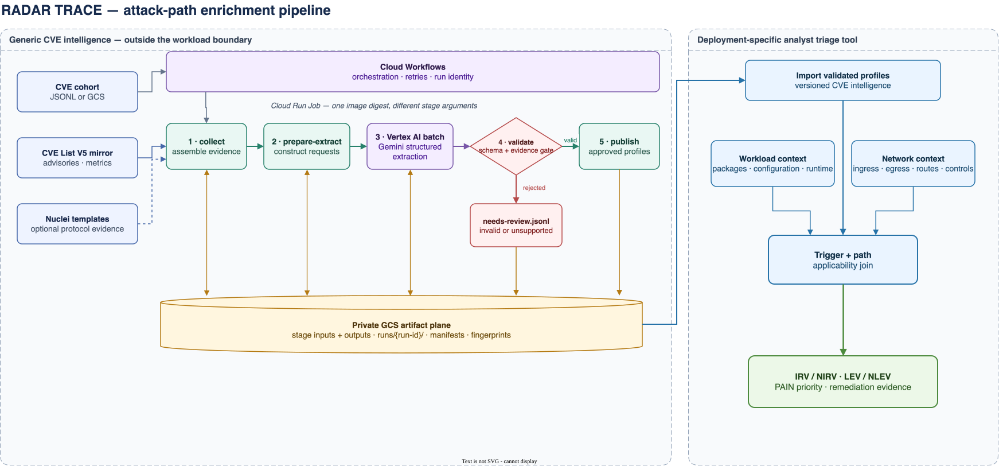

# RADAR TRACE

**Threat Reachability and Attack-path Context Enrichment**

RADAR TRACE turns flat CVE records into versioned, evidence-backed attack-path
profiles. It describes *how* vulnerable code is reached: the affected scope's
role, who initiates the relevant interaction, what triggers vulnerable behavior,
what the attacker controls, and which generic path capabilities are required.

The pipeline exists because CVSS `AV:N` means an exploit can traverse a network;
it does not prove an attacker can open an inbound connection to the vulnerable
component. RADAR TRACE preserves CVSS while adding the semantics analysts need
to reason about reachability.

RADAR TRACE produces generic CVE intelligence. It deliberately does **not**
declare a vulnerability reachable in a particular deployment. Its published
profiles can enrich any tool used to improve analyst triage workflows. A
consumer can combine a profile with configuration, network paths, and runtime
evidence to make an environment-specific decision.

This repository is the open, docs-and-data subset of RADAR TRACE: the
methodology, the JSON Schema contracts, and a point-in-time snapshot of the
published dataset. It does not include the pipeline implementation or
infrastructure.

## Current public snapshot

The `data/` directory is a sample of the corpus, published under the v2 contract
to show what a profile looks like and to let consumers validate against the
schemas shipped alongside it. It is not the complete registry.

## Architecture



The rendered diagram is generated from the editable
[draw.io source](docs/architecture.drawio).

The validation gate never guesses at model output. Invalid, oversized, truncated,
or unsupported output is quarantined; only structurally valid, evidence-linked
profiles reach publication. A semantic repair pass receives exact validator
errors. If that pass is token-truncated, one final source-only recovery request
runs without copying the prior candidate. Every substantive stage writes a
manifest and artifact fingerprint so a result can be traced to its inputs, model
request, and pipeline version.

Before constructing a Gemini request, the pipeline computes an `analysisKey`
from the CVE ID, evidence fingerprint, schema version, analyzer version, prompt
digest, and configured model. A registry lookup removes matching published
analyses from the pending cohort. Overlapping scans and scheduled cohorts
therefore do not incur repeat inference cost unless their evidence or analysis
contract changes, or the caller forces a re-run.

## Attack-path profile

Each profile contains a compact set of materially distinct paths rather than an
entire exploit graph. The portable
[attack-path profile JSON Schema](schemas/attack-path-profile-v2.schema.json)
is the current canonical `attack-path-profile/v2` contract. Version 1 remains
immutable and readable for historical records. Every discrete taxonomy value
has a title and definition in the schema; source IDs, locators, package
identities, version statements, and protocol versions remain extensible.

The v2 contract makes ownership explicit for attacker access, direct outcomes,
mitigation assessment, and narrative-only conditions while preserving the
inbound-versus-outbound path semantics. The published v2 envelope is defined by
[`published-attack-path-profile-v2.schema.json`](schemas/published-attack-path-profile-v2.schema.json).

An `attackPaths` entry describes one affected scope and one immediate vulnerable
boundary. Entries are alternatives. Within an entry, `attackerRequirements`,
`requiredPathCapabilities`, and `preconditions` are three CAPEC-compatible
prerequisite families and form an AND-set: every listed item is necessary.
`protocols` is a descriptive set; a strict
protocol requirement belongs in a typed precondition. Deployment
labels such as `internet-facing` or `cluster-internal` are intentionally absent;
they describe where software is deployed, not the generic CVE path. A consumer
resolves `remote-initiated-ingress`, for example, against its own routes, policy,
and runtime evidence.

The three prerequisite families align conceptually with CAPEC attack
prerequisites while retaining typed fields that a workload-aware consumer can
resolve. Optional `taxonomyMappings` associate a concrete CVE path with a CAPEC
pattern as `instance-of` or `related-to`; RADAR TRACE does not reproduce CAPEC's
full ordered execution-flow model. A CAPEC record or another source that states
the mapping must be supplied as evidence; the model does not derive CAPEC IDs
from CWE or CVSS alone.

`affectedScope.packages` preserves the CVE Record Format `collectionURL` and
`packageName` pair and may add a deterministically derived `purl`.
`affectedScope.versions` preserves `version`, range bounds, `versionType`, and
affected status so consumers can perform package and SBOM joins without parsing
a human-readable range.

| Field | Question answered |
| --- | --- |
| `affectedScope` | Which product, package, component, routine, behavior, or version range does this path describe? |
| `vulnerableRole` | Is that scope acting as a listener, client, peer, parser, local component, or unresolved role? |
| `interactionInitiator` | Who starts the interaction that reaches the vulnerable boundary? |
| `protocols` | Which normalized communication protocols and layers are evidenced? An empty list means no live protocol is required; strict requirements use a precondition. |
| `trigger` | Which operation and artifact activate the behavior, and how does that artifact cross the immediate boundary? |
| `attackerRequirements` | Which typed endpoint-control, network-position, input-control, or local-access prerequisites must the attacker satisfy? |
| `requiredPathCapabilities` | Which capabilities must all exist: remote-initiated ingress, vulnerable-component-initiated egress, on-path interception, peer networking, or local input transfer? |
| `preconditions` | Which typed version, configuration, feature, protocol, dependency, state, authentication, topology, or user-action conditions constrain the path? |
| `taxonomyMappings` | Which evidence-backed CAPEC patterns describe or relate to this concrete path? |
| `confidence` and `evidenceRefs` | How strongly is the path supported, and which exact claims support it? |
| `evidence` | Which collected source contains each claim, where it appears, which paths it bears on, and whether it is explicit, inferred, corroborating, or contradictory? |

This separates attacker control from topology. `remote-client`, for example,
says that the attacker controls the initiating endpoint; it does not claim the
endpoint is on the public internet. Likewise, `remote-endpoint` says the
vulnerable component contacts an attacker-controlled destination; it does not
claim that egress is permitted in a specific deployment.

Structurally valid profiles with `low` confidence, unresolved material fields,
or contradictory evidence remain publishable but carry
`reviewRecommended: true` in their validated and published envelopes. Invalid
or unsupported output stays in a separate review artifact. This preserves
uncertainty without silently turning it into a false classification.

## Example analyses

These examples show why CVSS AV:N alone is insufficient. Each describes generic
path requirements; a consumer still decides whether those requirements exist in
a particular environment.

| CVE | Attack pattern | Required path capabilities | What a consumer must determine |
| --- | --- | --- | --- |
| CVE-2023-44487 | A remote client reaches an HTTP/2 listener and sends rapid request/reset frames | `remote-initiated-ingress` | Is an affected HTTP/2 listener active, and can an untrusted client route to it? |
| CVE-2024-11053 | curl follows a redirect and leaks `.netrc` credentials to the redirect target | `vulnerable-component-initiated-egress` | Does the workload use affected curl behavior, redirects, and the required `.netrc` configuration? |
| CVE-2021-44228 | Attacker-controlled input reaches Log4j, which performs a JNDI lookup to a remote endpoint | `local-input-transfer` and `vulnerable-component-initiated-egress` | Can untrusted data reach Log4j, and can the process perform the callback? |

Primary references: [HTTP/2 Rapid Reset analysis](https://cloud.google.com/blog/products/identity-security/how-it-works-the-novel-http2-rapid-reset-ddos-attack),
[curl CVE-2024-11053 advisory](https://curl.se/docs/CVE-2024-11053.html),
and [Apache Log4j security advisory](https://logging.apache.org/security.html#CVE-2021-44228).

### CVE-2023-44487 — inbound listener

```json
{
  "attackPaths": [
    {
      "affectedScope": {
        "description": "HTTP/2 protocol implementations supporting stream multiplexing and cancellation",
        "vendor": "ietf",
        "versions": [
          {
            "status": "affected",
            "version": "2.0"
          }
        ]
      },
      "attackerAccess": {
        "authentication": {
          "requirement": "not-required"
        },
        "authorization": [],
        "evidenceRefs": [
          "ev-cve-desc"
        ],
        "executionPrivileges": [],
        "resourcePermissions": []
      },
      "attackerRequirements": [
        {
          "endpointRole": "remote-client",
          "evidenceRefs": [
            "ev-cve-desc"
          ],
          "id": "req-remote-client",
          "kind": "endpoint-control"
        }
      ],
      "confidence": "high",
      "directOutcomes": [
        {
          "confidence": "high",
          "description": "Uncontrolled server resource consumption leading to denial of service.",
          "evidenceRefs": [
            "ev-cve-desc"
          ],
          "locus": "vulnerable-component",
          "outcomeId": "out-dos",
          "primitive": "denial-of-service",
          "privilegeObtained": "none"
        }
      ],
      "evidenceRefs": [
        "ev-cve-desc"
      ],
      "interactionInitiator": "attacker-controlled-component",
      "mitigationAssessment": {
        "options": [],
        "status": "none-supported-by-collected-evidence"
      },
      "pathId": "path-http2-rapid-reset",
      "preconditions": [
        {
          "description": "The target server has HTTP/2 protocol support enabled on its listening socket.",
          "evidenceRefs": [
            "ev-cve-desc"
          ],
          "id": "precond-http2-enabled",
          "kind": "protocol",
          "resolution": "narrative-only"
        }
      ],
      "protocols": [
        {
          "id": "http2",
          "layer": "application"
        }
      ],
      "requiredPathCapabilities": [
        "remote-initiated-ingress"
      ],
      "taxonomyMappings": [],
      "trigger": {
        "artifact": "frame",
        "details": "The attacker sends HTTP/2 HEADERS frames immediately followed by RST_STREAM frames to rapidly create and cancel streams.",
        "directionAtBoundary": "remote-to-vulnerable",
        "phase": "protocol-message-processing"
      },
      "vulnerableRole": "listener"
    }
  ],
  "cveId": "CVE-2023-44487",
  "evidence": [
    {
      "claim": "The HTTP/2 protocol allows a denial of service (server resource consumption) because request cancellation can reset many streams quickly.",
      "evidenceId": "ev-cve-desc",
      "locator": "cna.descriptions[0].value",
      "pathRefs": [
        "path-http2-rapid-reset"
      ],
      "sourceId": "cve-list-v5",
      "sourceType": "cve-record",
      "strength": "explicit"
    }
  ],
  "schemaVersion": "attack-path-profile/v2"
}
```

### CVE-2024-11053 — outbound vulnerable client

```json
{
  "attackPaths": [
    {
      "affectedScope": {
        "description": "curl library and command-line tool",
        "vendor": "curl",
        "versions": [
          {
            "lessThanOrEqual": "8.11.0",
            "status": "affected",
            "version": "6.5",
            "versionType": "semver"
          }
        ]
      },
      "attackerAccess": {
        "authentication": {
          "requirement": "not-required"
        },
        "authorization": [],
        "evidenceRefs": [
          "ev-1"
        ],
        "executionPrivileges": [],
        "resourcePermissions": []
      },
      "attackerRequirements": [
        {
          "endpointRole": "redirect-target",
          "evidenceRefs": [
            "ev-1"
          ],
          "id": "req-1",
          "kind": "endpoint-control"
        }
      ],
      "confidence": "high",
      "directOutcomes": [
        {
          "confidence": "high",
          "description": "Credentials (password) used for the initial host are leaked to the redirect target host.",
          "evidenceRefs": [
            "ev-1"
          ],
          "locus": "downstream-component",
          "outcomeId": "out-1",
          "primitive": "information-disclosure",
          "privilegeObtained": "none"
        }
      ],
      "evidenceRefs": [
        "ev-1",
        "ev-2"
      ],
      "interactionInitiator": "vulnerable-component",
      "mitigationAssessment": {
        "options": [],
        "status": "none-supported-by-collected-evidence"
      },
      "notes": "Credential leakage occurs when netrc has a matching target host entry that lacks password credentials, causing curl to misapply the initial host's password to the redirect destination.",
      "pathId": "path-1",
      "preconditions": [
        {
          "description": "curl is configured to use a .netrc file containing credentials for the initial host and an entry for the redirect target host that omits the password or both login and password.",
          "evidenceRefs": [
            "ev-1"
          ],
          "id": "prec-netrc-config",
          "kind": "configuration",
          "resolution": "narrative-only"
        },
        {
          "description": "HTTP redirect following is enabled in curl.",
          "evidenceRefs": [
            "ev-1"
          ],
          "id": "prec-follow-redirects",
          "kind": "configuration",
          "resolution": "narrative-only"
        }
      ],
      "protocols": [
        {
          "id": "http",
          "layer": "application"
        }
      ],
      "requiredPathCapabilities": [
        "vulnerable-component-initiated-egress"
      ],
      "taxonomyMappings": [],
      "trigger": {
        "artifact": "redirect",
        "details": "curl receives an HTTP redirect response to a target host while configured to follow redirects and using netrc.",
        "directionAtBoundary": "remote-to-vulnerable",
        "phase": "remote-response-processing"
      },
      "vulnerableRole": "client"
    }
  ],
  "cveId": "CVE-2024-11053",
  "evidence": [
    {
      "claim": "curl leaks initial host credentials to a redirected host when using .netrc if the redirect target host entry in netrc omits the password or both login and password.",
      "evidenceId": "ev-1",
      "locator": "containers.cna.descriptions[0].value",
      "pathRefs": [
        "path-1"
      ],
      "sourceId": "cve-list-v5",
      "sourceType": "cve-record",
      "strength": "explicit"
    },
    {
      "claim": "curl versions from 6.5 up through 8.11.0 are affected.",
      "evidenceId": "ev-2",
      "locator": "containers.cna.affected[0].versions",
      "pathRefs": [
        "path-1"
      ],
      "sourceId": "cve-list-v5",
      "sourceType": "cve-record",
      "strength": "explicit"
    }
  ],
  "schemaVersion": "attack-path-profile/v2"
}
```

### CVE-2021-44228 — local trigger with callback

```json
{
  "attackPaths": [
    {
      "affectedScope": {
        "description": "Apache Log4j2 log4j-core JNDI lookup message substitution flaw",
        "vendor": "Apache Software Foundation",
        "versions": [
          {
            "lessThan": "2.15.0",
            "status": "affected",
            "version": "2.0-beta9",
            "versionType": "custom"
          },
          {
            "status": "unaffected",
            "version": "2.3.1"
          },
          {
            "status": "unaffected",
            "version": "2.12.2"
          },
          {
            "status": "unaffected",
            "version": "2.15.0"
          }
        ]
      },
      "attackerAccess": {
        "authentication": {
          "requirement": "not-required"
        },
        "authorization": [],
        "evidenceRefs": [
          "ev-cve-desc"
        ],
        "executionPrivileges": [],
        "resourcePermissions": []
      },
      "attackerRequirements": [
        {
          "evidenceRefs": [
            "ev-cve-desc"
          ],
          "id": "req-1",
          "kind": "input-control",
          "requirementValue": "untrusted-input"
        },
        {
          "endpointRole": "remote-endpoint",
          "evidenceRefs": [
            "ev-cve-desc"
          ],
          "id": "req-2",
          "kind": "endpoint-control"
        }
      ],
      "confidence": "high",
      "directOutcomes": [
        {
          "confidence": "high",
          "description": "Arbitrary code execution on the application host via attacker-controlled JNDI resource lookup.",
          "evidenceRefs": [
            "ev-cve-desc"
          ],
          "locus": "vulnerable-component",
          "outcomeId": "out-1",
          "primitive": "code-execution",
          "privilegeObtained": "same-as-locus"
        }
      ],
      "evidenceRefs": [
        "ev-cve-desc"
      ],
      "interactionInitiator": "upstream-component",
      "mitigationAssessment": {
        "options": [
          {
            "conditions": [
              {
                "description": "Set system property log4j2.formatMsgNoLookups or environment variable LOG4J_FORMAT_MSG_NO_LOOKUPS to true.",
                "evidenceRefs": [
                  "ev-cve-desc"
                ],
                "id": "mit-1-condition-1",
                "kind": "other",
                "resolution": "narrative-only"
              }
            ],
            "confidence": "high",
            "controlKind": "configuration",
            "description": "Disables message lookup substitution to prevent evaluation of JNDI expressions in log strings.",
            "effect": "prevents-path",
            "evidenceRefs": [
              "ev-cve-desc"
            ],
            "mitigationId": "mit-1"
          }
        ],
        "status": "documented"
      },
      "pathId": "path-1",
      "preconditions": [
        {
          "description": "Log message lookup substitution is enabled.",
          "evidenceRefs": [
            "ev-cve-desc"
          ],
          "id": "pre-1",
          "kind": "runtime-feature",
          "resolution": "narrative-only"
        }
      ],
      "protocols": [
        {
          "id": "ldap",
          "layer": "application"
        },
        {
          "id": "tcp",
          "layer": "transport"
        }
      ],
      "requiredPathCapabilities": [
        "vulnerable-component-initiated-egress",
        "local-input-transfer"
      ],
      "taxonomyMappings": [],
      "trigger": {
        "artifact": "api-arguments",
        "details": "Application passes untrusted input containing a JNDI lookup pattern into the Log4j logging API.",
        "directionAtBoundary": "local-to-vulnerable",
        "phase": "local-invocation"
      },
      "vulnerableRole": "local-component"
    }
  ],
  "cveId": "CVE-2021-44228",
  "evidence": [
    {
      "claim": "Apache Log4j2 JNDI features do not protect against attacker controlled LDAP endpoints, allowing remote code execution when message lookup substitution is enabled.",
      "evidenceId": "ev-cve-desc",
      "locator": "containers.cna.descriptions[0].value",
      "pathRefs": [
        "path-1"
      ],
      "sourceId": "cve-list-v5",
      "sourceType": "cve-record",
      "strength": "explicit"
    }
  ],
  "schemaVersion": "attack-path-profile/v2"
}
```

### Mitigation assessment — CVE-2026-18649

`mitigationAssessment` is the one part of a profile that can close a finding
outright, so it is also the easiest to misread. Options are **alternatives**;
the `conditions` inside a single option must **all** hold. Each option declares
a `controlKind`, and only independent controls are published: upgrading to a
fixed release is already carried by `affectedScope.versions`, so
`version-upgrade` never appears here.

This GStreamer RTP depayloader flaw carries four options across three kinds —
enforce SRTP authentication, restrict who can send RTP, compile the plugin out,
or derank the elements. Any one of them prevents the path. Only the
`mitigationAssessment` block is shown; the full record is
[`data/2026/CVE-2026-18649.json`](data/2026/CVE-2026-18649.json).

Note every condition is `narrative-only`: the evidence supports the control but
not a machine-checkable predicate, so a consumer routes these to an analyst
rather than resolving them automatically.

```json
{
  "options": [
    {
      "conditions": [
        {
          "description": "Deploy the srtpdec element in the pipeline prior to the depayloader.",
          "evidenceRefs": [
            "ev-2"
          ],
          "id": "mit-1-condition-1",
          "kind": "other",
          "resolution": "narrative-only"
        }
      ],
      "confidence": "high",
      "controlKind": "configuration",
      "description": "Enforcing SRTP packet authentication causes unauthenticated RTP fragments to be rejected before reaching the depayloaders.",
      "effect": "prevents-path",
      "evidenceRefs": [
        "ev-2"
      ],
      "mitigationId": "mit-1"
    },
    {
      "conditions": [
        {
          "description": "Restrict network access to the GStreamer RTP receiving endpoints to trusted peers via firewall rules.",
          "evidenceRefs": [
            "ev-2"
          ],
          "id": "mit-2-condition-1",
          "kind": "other",
          "resolution": "narrative-only"
        }
      ],
      "confidence": "high",
      "controlKind": "access-restriction",
      "description": "Network filtering prevents untrusted network entities from initiating RTP traffic streams to the vulnerable component.",
      "effect": "prevents-path",
      "evidenceRefs": [
        "ev-2"
      ],
      "mitigationId": "mit-2"
    },
    {
      "conditions": [
        {
          "description": "Compile the gstreamer-plugins-good package with the -Drtp=disabled meson build option.",
          "evidenceRefs": [
            "ev-2"
          ],
          "id": "mit-3-condition-1",
          "kind": "other",
          "resolution": "narrative-only"
        }
      ],
      "confidence": "high",
      "controlKind": "usage-change",
      "description": "Disabling the RTP plugin completely omits the vulnerable RTP depayloader elements from the build.",
      "effect": "prevents-path",
      "evidenceRefs": [
        "ev-2"
      ],
      "mitigationId": "mit-3"
    },
    {
      "conditions": [
        {
          "description": "Set the GST_PLUGIN_FEATURE_RANK environment variable to rtph264depay:0,rtph265depay:0.",
          "evidenceRefs": [
            "ev-2"
          ],
          "id": "mit-4-condition-1",
          "kind": "other",
          "resolution": "narrative-only"
        }
      ],
      "confidence": "high",
      "controlKind": "configuration",
      "description": "Setting the element ranks to 0 prevents GStreamer auto-plugging pipelines from automatically selecting the affected depayloaders.",
      "effect": "prevents-path",
      "evidenceRefs": [
        "ev-2"
      ],
      "mitigationId": "mit-4"
    }
  ],
  "status": "documented"
}
```


## Pipeline stages

| Stage | Responsibility | Execution |
| --- | --- | --- |
| `index-nuclei` | Build optional CVE-to-protocol observations from a Nuclei templates checkout | Local or preparatory job |
| `collect` | Gather and normalize CVE, advisory, patch, VEX, and scanner evidence | Batch job |
| `plan-analysis` | Split reusable cache hits from pending CVEs using the analysis identity | Batch job |
| `prepare-extract` | Produce deterministic structured-extraction requests | Batch job |
| model batch | Extract scoped attack paths and evidence references | Vertex AI Gemini batch |
| `validate` | Enforce the core contract and source-backed evidence links; separate invalid review items | Batch job |
| `prepare-repair` | Create one bounded, error-conditioned retry for model-validation failures only | Batch job |
| repair model batch | Re-extract failed profiles from the original evidence and exact validator errors | Vertex AI Gemini batch |
| `prepare-recovery` | Create one clean, source-only retry for a token-truncated repair | Batch job |
| recovery model batch | Regenerate only truncated repairs with a smaller output budget and low thinking level | Vertex AI Gemini batch |
| `reconcile` | Replace first-pass failures with repair outcomes without duplicating CVEs | Batch job |
| `publish` | Add immutable run metadata to validated profiles; attach deterministic CVSS metadata | Batch job |
| `registry-sync` | Merge immutable revisions into the registry, emit added or materially updated profiles, and rebuild the stable CVE-keyed JSON objects served to consumers | Batch job |
| consumer import | Join profiles to environment-specific evidence and analyst decisions | Any compatible triage or analysis tool |

The model returns only the reusable core profile. Validation wraps it in
`validated-attack-path-profile/v2` with provenance and review signals. The
stable CVE-keyed public projection emits
`published-attack-path-profile/v2`, which adds a `cvss` array containing every
CNA and ADP CVSS vector found in the mirrored CVE List V5 record (including
version, exact vector string, source, metric key, and available base score and
severity). This metadata is deterministic and does not participate in the
attack-path analysis/cache identity.

## Using a profile

A profile states generic path requirements. Turning that into a decision about
a specific deployment is the consumer's job, and it is easy to do unsoundly.
[Reachability gates](docs/reachability-gates.md) documents the join: the order
the requirements should be tested in, the four dispositions a finding can
resolve to, why failing to prove a path open is not the same as proving it
closed, and the specific inferences the procedure must refuse to make.

## Data snapshot

The `data/` directory in this repository is a point-in-time export of the
published dataset: one `published-attack-path-profile/v2` record per CVE,
sorted into a folder per CVE year (`data/2026/CVE-2026-17434.json`, etc.). It is
a sample of the corpus rather than the complete registry, every record carrying
an `attack-path-profile/v2` core and validating against
[`published-attack-path-profile-v2.schema.json`](schemas/published-attack-path-profile-v2.schema.json).
It is the same stable, CVE-keyed projection the live system serves at:

```text
https://radar-trace.thearmory.cloud/cves/CVE-2026-17434.json
```

A consumer should use `profile.cveId` as its join key and combine a profile
with its own finding, package, image, configuration, and runtime evidence to
make an environment-specific decision. RADAR TRACE deliberately does not
declare a vulnerability reachable in any particular deployment.
