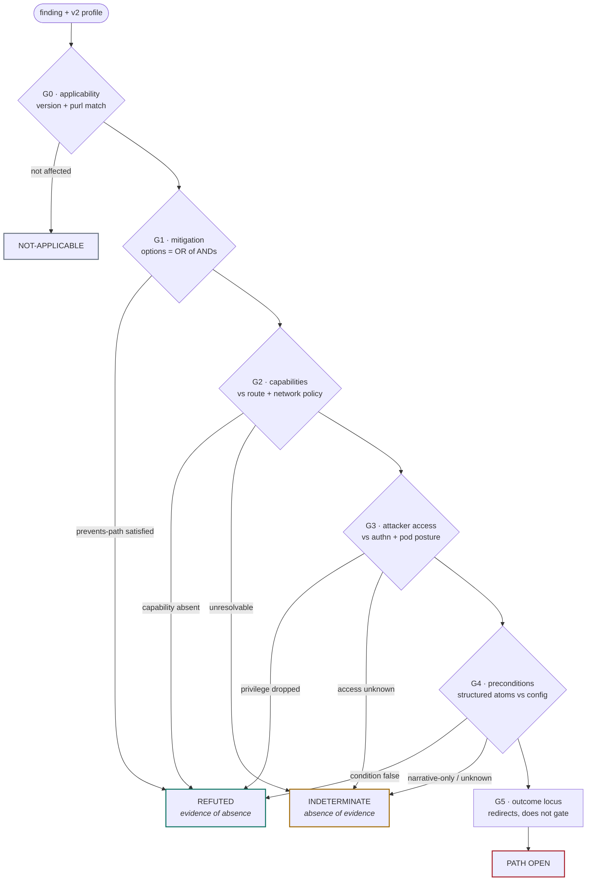

# Reachability gates

How a scanner finding plus an `attack-path-profile/v2` record resolves into a
disposition — and, more importantly, where it is honest to stop and say the
evidence does not decide.

RADAR TRACE publishes generic, deployment-independent path intelligence. It
never states that a vulnerability is reachable in a particular environment.
This document describes the join a consumer performs to reach that conclusion
themselves, and the inferences that join must refuse to make.

> **Applies to the `attack-path-profile/v2` core contract**
> ([schema](../schemas/attack-path-profile-v2.schema.json)). The current
> `data/` snapshot predates it: every published record in this repository
> carries an `attack-path-profile/v1` core, which has no `attackerAccess`,
> `directOutcomes`, `mitigationAssessment`, or structured condition atoms.
> Gates G1, G3, G4, and G5 below therefore cannot be evaluated against the
> present snapshot. Treat this as the procedure the v2 corpus is being built
> for, not one you can run against `data/` today.

## Four dispositions

A finding never resolves to "vulnerable" or "safe." It resolves to one of four
states, only two of which permit closing it.

| Disposition | Meaning | Closeable |
| --- | --- | --- |
| `NOT-APPLICABLE` | Installed version or package identity falls outside `affectedScope`. | Yes |
| `REFUTED` | A requirement is *positively evidenced absent*, or a mitigation is evidenced present. | Yes |
| `INDETERMINATE` | At least one requirement is unresolved. Routes to an analyst. | No |
| `OPEN` | Every requirement resolved true against real environment evidence. | Act |

## The governing rule

**`REFUTED` requires positive evidence of absence.** Failing to demonstrate
that a path is open does not demonstrate that it is closed — that outcome is
`INDETERMINATE`. Every gate below may emit `REFUTED` only from an affirmative
environment fact, never from a missing one.

This single asymmetry is what separates a triage procedure from a false-negative
generator. It is also why `INDETERMINATE` will dominate any corpus built from
sparse CVE-record evidence, and why that is correct behavior rather than a
defect: the volume of `INDETERMINATE` measures source coverage, not exposure.

## The tree

Gates run in order and short-circuit. Each `attackPaths` entry is evaluated
independently, because paths are *alternatives*. Requirements *within* a path
are conjunctive.

A finding carries many paths. Its disposition is the **most severe surviving
path**: any path `OPEN` makes the finding `OPEN`; only *all* paths refuted makes
the finding `REFUTED`. Never intersect requirements across paths — that is the
single most damaging modeling error available here.

## Gate detail

### G0 — Applicability

Match `affectedScope.versions` and package identity against the scanned package
URL, not the CVE ID alone. A CVE can apply to a product you run through a
package you do not.

| Branch | Condition |
| --- | --- |
| `NOT-APPLICABLE` | Version outside range, or the profile's product is not this package. |
| Continue | Scanner reports the package affected and the package identity matches. |

### G1 — Mitigation short-circuit

Run this before the expensive gates; it is the cheapest cohort-level cull.
`mitigationAssessment.options` is an OR-set, and the `conditions` inside one
option are an AND-set.

| Branch | Condition |
| --- | --- |
| `REFUTED` | All conditions of some option resolve true and its `effect` is `prevents-path`. |
| Recompute | `alters-outcomes`: effective outcomes = baseline − `replacedOutcomeRefs` + `residualOutcomes`. Continue with the reduced set. |
| Annotate | `raises-difficulty`: record it, do not act on it. It is the floor value, not a control. |
| Continue | `none-supported-by-collected-evidence` carries *no information*. It never means no mitigation exists. |

### G2 — Required path capabilities

The core discriminator, and the one fact no scanner emits. All capabilities in
a path must hold.

| Branch | Condition |
| --- | --- |
| `REFUTED` | Any capability positively evidenced absent — for example a default-deny egress policy against `vulnerable-component-initiated-egress`. |
| `INDETERMINATE` | Any capability unresolvable. `local-input-transfer` almost always lands here, as does `unknown`. |
| Continue | All capabilities evidenced present. Record the *tier* of reachability: internet, cluster, or namespace. |

Resolution against environment evidence:

| Required capability | Question to answer | Deciding evidence |
| --- | --- | --- |
| `remote-initiated-ingress` | Can an untrusted initiator reach a listening port? | Route objects, service type, ingress network policy |
| `vulnerable-component-initiated-egress` | Can the workload open outbound to an attacker-influenced destination? | Egress policy, NAT and proxy config, DNS policy. **Ingress exposure is irrelevant here.** |
| `on-path-interception` | Is there an untrusted segment between the endpoints? | TLS and mTLS posture, mesh configuration, segment trust |
| `peer-network-interaction` | Can an attacker be a protocol peer? | Federation, clustering, and peering configuration |
| `local-input-transfer` | Can attacker-influenced data reach the vulnerable code? | Dataflow. Rarely available — expect `INDETERMINATE` |
| `unknown` | — | None. `INDETERMINATE` by construction |

### G3 — Attacker access

Test `attackerAccess` against identity posture and, where available, workload
security context.

| Branch | Condition |
| --- | --- |
| `REFUTED` | A required OS capability is dropped, or a non-root constraint forecloses a required privilege. |
| `INDETERMINATE` | `authentication.requirement` is `unknown`. This is *not* `not-required` and must never be collapsed into it. |
| Continue | `not-required`, or the attacker can plausibly hold the account at the reachability tier recorded in G2. |

Account obtainability is the softest test in this procedure. Where it cannot be
answered from configuration, it is `INDETERMINATE`, not a pass.

### G4 — Preconditions

An AND-set of condition atoms. The `resolution` discriminator states whether a
machine may answer the atom at all.

| Branch | Condition |
| --- | --- |
| `REFUTED` | A `structured` atom resolves false against a real configuration source. |
| `INDETERMINATE` | `narrative-only` or `unknown`. Prose is an analyst's job; do not pattern-match it. |
| Continue | Every structured atom resolves true. |

### G5 — Outcome locus

This gate never refutes. It answers *which asset you should actually be looking
at*, which is frequently not the one the finding is attached to.

| `locus` | Where to look |
| --- | --- |
| `vulnerable-component` | The affected process itself, bound by its own posture. |
| `host` | The machine beyond the component. Check escape posture and whether the host is shared. |
| `interacting-client` | The exposed asset is a *user session*. Evaluate who consumes this service. |
| `downstream-component` | Invert the question: what can this component reach? Metadata services, internal APIs, databases. |
| `stored-state` | Persistence beyond the process lifetime. Survives the patch. |

`privilegeObtained` is relative to the locus, so it must be read together with
the posture of whatever that locus turns out to be.

## Worked example

The same workload, the same public route, three different CVEs. The capability
requirement is what separates them, and severity alone does not.

| Finding | Required capability | Does the route matter? | Disposition |
| --- | --- | --- | --- |
| HTTP/2 listener defect | `remote-initiated-ingress` | **Decisive.** The public route is the whole answer | `OPEN` |
| curl `.netrc` redirect leak | `vulnerable-component-initiated-egress` | **Irrelevant.** Egress policy decides; the route contributes nothing | `INDETERMINATE` until egress is resolved |
| `tar` setuid extraction defect | `local-input-transfer` | **Irrelevant.** Requires attacker-influenced archive extraction | `INDETERMINATE`, lowest urgency |

Two of the three are unaffected by the property that would normally drive their
prioritization. That gap is the operational argument for evaluating path
capabilities rather than workload exposure alone.

## Inferences this procedure forbids

| Do not conclude | Because |
| --- | --- |
| `endpointRole: remote-client` means internet-facing | It means the attacker controls the initiating endpoint. Where that endpoint sits is a G2 question. |
| An internet-accessible workload makes every CVE on it internet-reachable | Workload exposure and path reachability are different facts. G2 joins them. |
| High path `confidence` means likely exploitation | It means the path is well evidenced. Exploit likelihood lives in EPSS and KEV, outside the profile. |
| `reviewRecommended: false` means reviewed and cleared | It means no configured trigger fired. Nobody looked at it. |
| An empty mitigation `options` array means no mitigation exists | It means none was found in the collected evidence, often just a thin CVE record. |
| `authentication.requirement: unknown` can be treated as unauthenticated | `unknown` is a distinct enum value precisely so it cannot be. It forces `INDETERMINATE`. |
| Requirements from different paths can be intersected | Paths are alternatives. Evaluate each independently; take the most severe survivor. |
| A low EPSS score closes a finding | External signals reorder the queue. They never change whether a path is reachable. |

## Boundaries

- **Whether exploitation would succeed.** The procedure resolves *prerequisites*,
  not reliability, complexity, or weaponization — all explicitly outside the v2
  contract.
- **How much harm results.** `directOutcomes` describes a direct technical
  capability at a locus. Data sensitivity, blast radius, and business impact are
  the consumer's to supply.
- **Whether an `INDETERMINATE` result is dangerous.** It is a statement about
  evidence, not about risk.
- **Anything for a CVE with no profile.** That case degrades to CVSS and EPSS
  only, and should be labelled degraded rather than silently mixed into the same
  queue.
